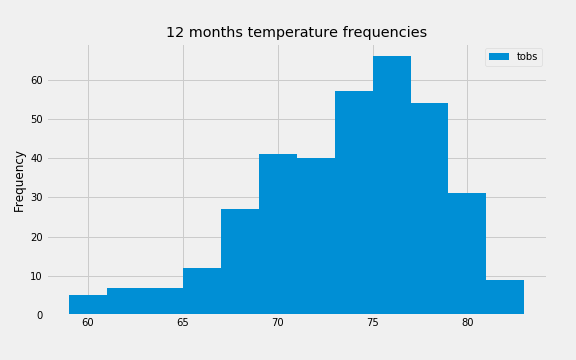
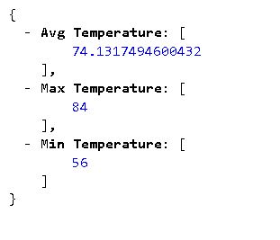
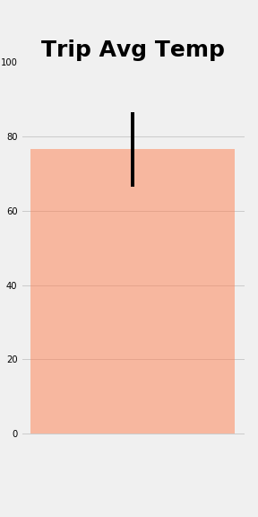

# Surfs Up!


This project is about climate analysis on Honolulu, Hawaii!. Below are listed the types of analysis done.

## Step 1 - Climate Analysis and Exploration

This basic climate analysis analysis and data exploration of Hawaii database is completed using Python ,SQLAlchemy ORM queries, Pandas, and Matplotlib.

* A start date and end date for the trip has been assumed spanning approximately 3-15 days total.

* Hawaai database consists of 2 tables named 'Measurement' and 'Station' and they have been reflected into two python classes using SQLAlchemy.

* Below are the different analysis done.

### Precipitation Analysis

* Last 12 months precipitation data sorted by date.

  
  
  *Analysis*

_The above graph is showing the daily precipitation for the last 12 months between 2017-08-23 and 2016-08-23. Maximum precipitation reported is approximately 6.7mm and 6.3. On the whole, precipitation has been below 3mm throughout the year. So despite being an island, this particular location in Hawaii doesn't seem to get that much rain and so good for vacation thoughout the year._

_Note: Unit of precipitation is not given and it's assumed that it's in mm._

* Summary statistics for the precipitation data.
 
  
  
  *Analysis*

_The dataset has a total of 2230 records in the 12 months period. Average precipitation is 0.16 mm, minimum and maximum precipitation values are 0 and 6.7 mm respectively. 25, 50 and 75 percentile values are 0, 0.01 and 0.11 respectively. In nutshell, the data shows that in the 12 months period when data was collected, not many heavy rain days have been reported._

### Station Analysis

* Total number of stations.

_Number of stations : 9_


* Most active stations. List the stations and observation counts in descending order.

```
[('USC00519281', 2772),
 ('USC00519397', 2724),
 ('USC00513117', 2709),
 ('USC00519523', 2669),
 ('USC00516128', 2612),
 ('USC00514830', 2202),
 ('USC00511918', 1979),
 ('USC00517948', 1372),
 ('USC00518838', 511)]
 
 ```

  * Which station has the highest number of temperature observations?
  
  ```
  USC00519281
  
  ```

* Last 12 months of temperature observation data (tobs).

  * Filter by the station with the highest number of observations.
  
  ```
  Station with Highest NUmber of Observations is USC00511918
  
  ```

  * Plot the results as a histogram with `bins=12`.

    
    
    *Analysis*

    _From the above graph, for station USC00511918 has reported approximately 76 degrees F most of the days in last 12 months. This indicates that        station USC00511918 is an ideal spot for vacation as the lowest reported is near to 60F and highest close to 85 with less than 10 times in the      last year. Also Station USC00511918 comes in 7th position for the top list of most active stations with a count of 1979._

- - -

## Step 2 - Climate App

Click here to access the [Weather API file](./app.py).


### Routes

* `/`

  * Home page.

  * List all routes that are available.
  
  

* `/api/v1.0/precipitation`

 

* `/api/v1.0/stations`

 

* `/api/v1.0/tobs`

 


* `/api/v1.0/<start>` 

 

* `/api/v1.0/<start>/<end>`


 

 

### Other Analyses

### Temperature Analysis



### Daily Rainfall Average.

* Rainfall per weather station using the previous year's trip dates dates.

```
Trip Start date in last year 2016-06-19, End date 2016-07-01

```
```
[('USC00516128', 'MANOA LYON ARBO 785.2, HI US', 21.3331, -157.8025, 152.4, 4.789999999999999), ('USC00519281', 'WAIHEE 837.5, HI US', 21.45167, -157.84888999999998, 32.9, 2.6199999999999997), ('USC00513117', 'KANEOHE 838.1, HI US', 21.4234, -157.8015, 14.6, 1.4600000000000002), ('USC00514830', 'KUALOA RANCH HEADQUARTERS 886.9, HI US', 21.5213, -157.8374, 7.0, 1.24), ('USC00519523', 'WAIMANALO EXPERIMENTAL FARM, HI US', 21.33556, -157.71139, 19.5, 0.32999999999999996), ('USC00517948', 'PEARL CITY, HI US', 21.3934, -157.9751, 11.9, 0.1), ('USC00519397', 'WAIKIKI 717.2, HI US', 21.2716, -157.8168, 3.0, 0.07999999999999999)]
```

* Daily normals in Pandas DataFrame with date as index.


* Use Pandas to plot an area plot (`stacked=False`) for the daily normals.

  
  
  *Analysis*

_During the trip days spanning 12 days, only on 20th, 24th maximum temperature was going close up to 85 degrees F and rest all days it was between 75 to 80 range._
_Average temperature has been stead mostly ranging between 75 and 80 degrees F._
_Minimum temperature has been stead ranging between 68 to 70 degrees F._
_As the trip dates have been planned during peak summer time ( June and July), these temeratures are not that bad and and good for outdoor activities._